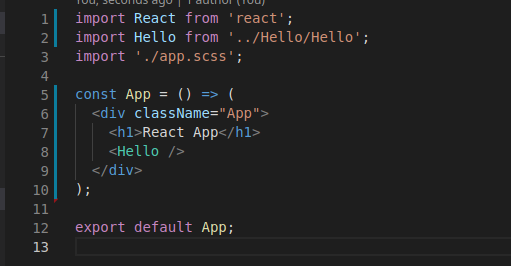
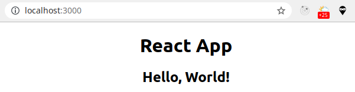

# React - немного основ
Некоторое время назад я начал эту серию шпаргалок-заметок в репозитории. Отчасти всё это было "запущено" моим участием в курсе по Реакту в РСС. Про школу я уже писал в жж. Здесь уже писал про то как, на мой взгляд, проще всего прикрутить к приложению на Реакт Ридакс. И вот... решил сделать пару шагов назад, и написать пару слов про Реакт.

## Что такое Реакт?
[Официальный сайт Реакта](https://ru.react.js.org/) даёт нам однозначный ответ на этот вопрос: Реакт - это JavaScript-библиотека для создания пользовательских интерфейсов. Кстати, прямо на главной странице проекта есть маленькие демки-песочницы: слева редактируем код, справа тут же видим результат!

## Основы основ Реакта
Вообще, всем, кому могу, я рекомендую вот [этот курс от немца Макса](https://www.youtube.com/watch?v=Dorf8i6lCuk&t) - за 4 часа он проходит по очень многим базовым вещам, не просто показывая их, но и логически подводя к каким-то решениям. Но. Четыре часа видео посмотреть, а ещё на английском, а ещё... А ещё на курсе, например, запретили [Create React App](https://ru.reactjs.org/docs/create-a-new-react-app.html) - это быстрый и официальный способ получить приложение, но. В общем, поговорим про: Компоненты, Свойства (props) и Стейт (State).

## Компонент - Component
Компонент - это такой "кирпичик" из которых строятся приложения на Реакте.
Компонент может содержать в себе другие компоненты.
Приложение - это, чаще всего, компонент App, в котором содержатся другие компоненты - много или мало.)
В компонентах используется идея [Модулей JS](https://learn.javascript.ru/modules-intro#chto-takoe-modul) - хорошая практика - это "Компонент - отдельный файл, из которого сделан экспорт по-умолчанию".

Кстати, не будем мудрить, снова обратимся к [Документации](https://ru.react.js.org/docs/components-and-props.html): Компоненты позволяют разделить пользовательский интерфейс на независимые, повторно используемые части и работать с каждой из частей отдельно.

Пожалуй, первое разделение компонентов - это функциональные и классовые. Классовые были "изначально". Функциональные появились относительно недавно. Насколько я знаю, функциональные считаются менее "прожорливыми" и более "прогрессивными", поэтому первые шаги я бы делал именно на них.

## Запуск приложения
Примеры. Да, как обычно, мне без примеров трудно. CRA для примеров использовать не буду - клонирую вот этот [репозиторий](https://github.com/abr-ya/react-vite-eslint-test). Он создан на основе [Vite](https://vitejs.dev/guide/), в сборку добавлены ESLint (конфиг Airbnb), Prettier и React Testing Library. После клонирования я обычно ставлю пакеты командой
```
npm i
```

в коммандере перехожу в папку проекта и вызываю
```
code .
```

что в большинстве ОС запускает VSCode c текущей папкой. Дальше в VSCode открывю терминал (Ctrl + ~) и работаю в этом окне. Запуск приложения:
```
npm run dev
```

В терминале видим:


А в браузере по адресу http://localhost:3000/


У нас уже что-то работает! Это хорошо.

## Компоненты - можно продолжать
Откроем папку components в папке src. Сейчас там одна папка App, а в ней 3 файла:
- App.jsx - это компонент,
- app.scss - это стили компонента,
- App.test.js - это тесты, они очень примитивные, но работают)).

В файле main.jsx (в папке src) мы можем уведеть, как App импортируется и рендерится в диве с id root - никакой магии.)

Посмотрим внимательнее на компонент:


Много кода. Сделаем его проще:


Если линтер работает, он начеркает нам красным, и это хорошо!)
Что он от нас хочет?
- мы импортируем useState,и не используем - удалим импорт,
- мы используем "длинную" запись стрелочной функции c кудрявыми скобками и сразу вызываем return - исправим на короткую запись с круглыми скобками.
Получается примерно так:


Сохраняем, идём в браузер, и видим, что там уже всё обновилось:


Собственно, это и есть основной цикл работы с Реактом: изменить код, сохранить, посмотреть в браузере. Если "картинки" нет - смотрим ошибки в консоли.

Итог: компонент - это класс или функция. В нашем простом примере это функция, которая возвращает JSX.

## Новый компонент
Создадим компонент. Свобода действий почти полная, но обязательно компонет должен называться с большой буквы и соблюдать правила нейминга функций, а из разряда соглашений - это положить его в папку components и в ней - папку с его именем (хотя вообще структура может быть разной). Создадим компонент Hello.

У меня получилось вот так:


На что-то похож, правда?)

Кажется, самое время импортировать наш новый компонент и использовать его в нашем корневом компоненте App. Ну и заголовок h1 я чуть подправлю, чтобы они не повторялись:



Добавились всего только вторая и восьмая строка. А приложение стало разнообразнее:



Прелесть компонентов в том, чьл мы можем использовать их сколько угодно раз в любой части приложения:


Вот только пока как-то... однообразно:


И вот тут мы плавно подходим к тому, что нам нужны свойства...


