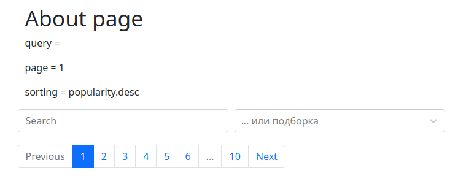

# React - State компонента
В [прошлый раз](./img/react-1) я прошелся на примере по таким базовым вещам как компоненты и свойства. До стейта там дело не дошло. Пришло время исправиться и поговорить про стейт. Итак, человеческим языком, что такое стейт? Это такое локальное хранилище данных, которые меняются в процессе работы и нужны компоненту и/или его дочерним компонентам.

## Хук useState
Для работы со стейтом в функциональных компонентах используется хук useState. Вообще, с хуками надо знакомиться, хоть самыми простыми, как можно быстрее. Без них "на функциях" много не напишешь. Снова можно обратиться к [документации](https://reactjs.org/docs/hooks-state.html). А мы снова пройдемся по живому примеру.

## Реальный кейс
У нас есть страница, с которой выполняется запрос на поиск фильмов или подборку топа. Фильмы выводятся с пагинацией. Таким образом нам надо как-то управлять следующими параметрами:
- запрос - для поиска,
- сортировка подборки - как альтернатива поиску,
- страница - актуально и там, и там.)

Добавим себе "развлечений" - будем менять эти параметры в одном дочернем компоненте, а выводить... выводить нам их вроде и не надо, но для наглядность выводить будем в другом.

Итак, для начала работы нам надо добавить хук к импортам (копирую из документации):
```javascript
import React, { useState } from 'react';
```

Далее нам надо в самом начале компонента наш стейт объявить. Допустим, как-то так:
```javascript
  const [sorting, setSorting] = useState('popularity.desc');
  const [query, setQueryState] = useState('');
  const [page, setPage] = useState(1);
```

При объявлении стейта используется деструктуризация. Первый аргумент - наша переменная, или часть стейта, второй - сеттер для неё. Поэтому по соглашению нейминг происходит с использованием подхода "name, setName". Как аргумент хуку передаём значение по-умолчанию, когда компонент будет монтироваться. Всё, можно работать.

## Вывод в дочернем компоненте
Временное решение для демонстрации - я буду использовать страницу About. Получается такой примерно компонент:
```javascript
const About = ({ query, page, sorting }) => {
  console.log(query, page, sorting);

  return (
    <div className="container">
      <h1>About page</h1>
      <p>{`query = ${query}`}</p>
      <p>{`page = ${page}`}</p>
      <p>{`sorting = ${sorting}`}</p>
    </div>
  );
};
```

С деструктуризацией пропсов мы уже знакомы, со страковыми шаблонами - вроде тоже.)
Импортируем компонент.
Подключим его на странице:
```javascript
      <About query={query} page={page} sorting={sorting} />
```

Сохраним, посмотрим, что получилось:


Да, два заголовка h1, лучше так не делать!)
Это у нас компонент отображения.
Теперь займемся изменением.

## Сеттеры в дочерний компонент
Я пишу компонент RequestSetup, который должен объединить в себе всё, что связано с изменением параметров запроса. По сути он будет обверткой для написанных ранее простых компонентов пагинации и поисковой строки + я буду использовать в нём Select из пакета react-select для выпадающего списка. Для передачи сеттеров в него одним свойством я соберу их в объект:
```javascript
  const setters = {
    setPage,
    setSorting,
    setQuery,
  };
```

Также т.к. кейса два, и они исключают друг друга, мне надо передать "вниз" поисковую фразу, а для пагинации - текущую страницу, также в объект:
```javascript
  const control = {
    query,
    page,
  };
```

Теперь при вызове RequestSetup передам в него оба объекта:
```javascript
      <RequestSetup
        setters={setters}
        control={control}
        pages={pager && pager.total ? pager.total : 10}
      />
```

Это не так важно для нашего кейса, но вот так RequestSetup выглядит изнутри:


По сути, три компонента и каждый со своим обработчиком.
Сохраним родительский компонент.
Два компонента выглядят вместе вот так:



А работают вот так:


## Итоги
мы:
- познакомились с хуком useState,
- потренировались создавать стейт,
- потренировались передавать стейт и его сеттеры в дочерние компоненты,
- написали пример, в котором стейт компонента отображается в одном дочернем компоненте, а меняется из другого (точнее - спускается дальше и только там меняется)).
