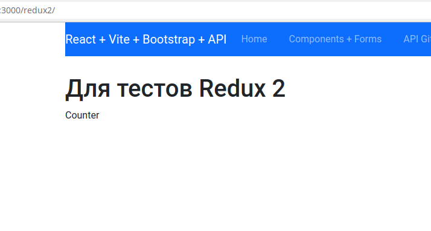
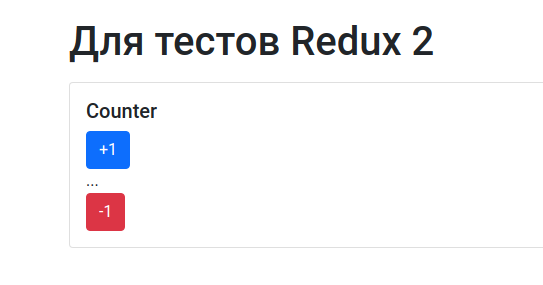
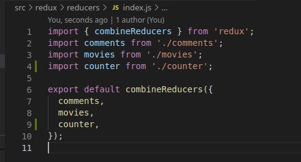
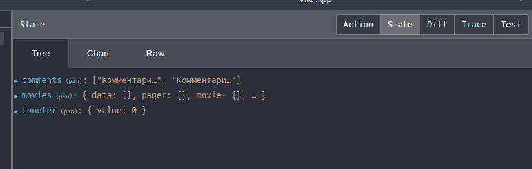
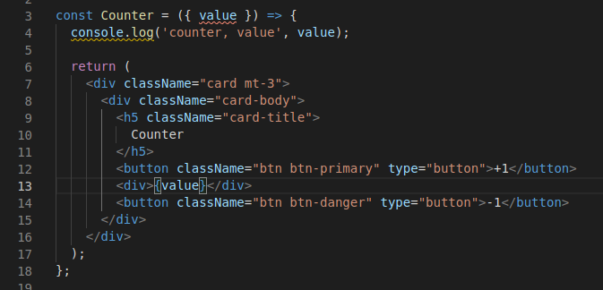
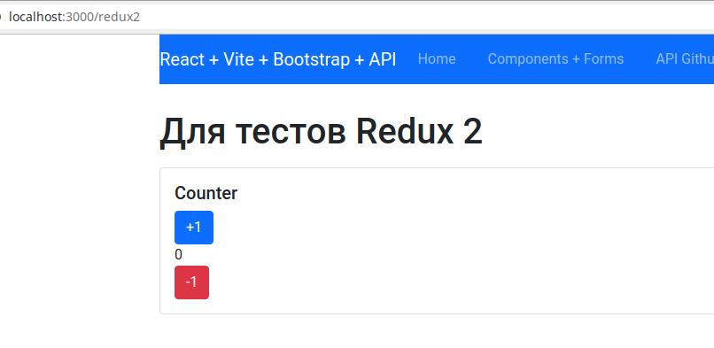
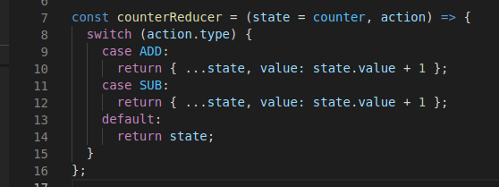
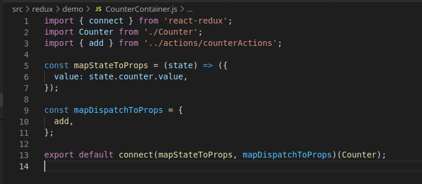
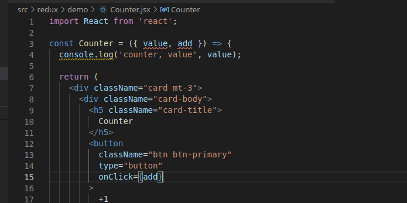
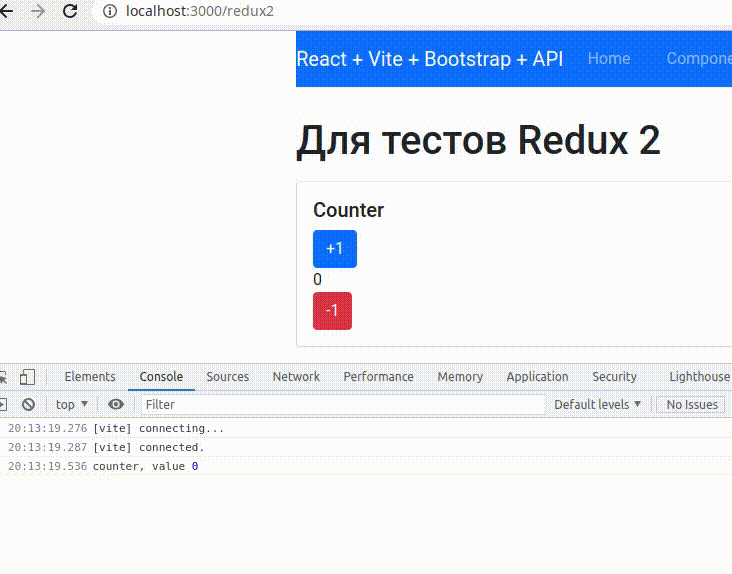

# Redax, он же с Реактом, человеческим языком
Не так давно я в очередной раз прикручивал Ридакс к проекту на Реакте, и по ходу дела написал себе шпаргалку. А потом у меня возник вопрос: понял бы я эту шпаргалку, если бы сейчас начинал работать с Ридакс? Думаю, нет. И я решил написать немного текста про то, зачем и как всё это.

## Паттерн Flux
Много раз нам сказали, что Redux - лишь одна из реализаций паттерна Flux. Мне, например, нравится , и отдельно - комментарии к ней. Но я хочу порассуждать про Ридакс в Реакт приложении не с точки зрения паттерна, а с т.з. разработчика, у которого "было без Ридакса, а надо - с".

## Как было
Это реальный кейс. У нас есть приложение. Есть роутер и страницы: общая, с каким-то списком карточек (новости, картинки, у меня - фильмы) и детальная. Дальше каждая из этих страниц:
- использует хук useEffect - срабатывает на загрузку и изменение параметров запроса,
- при срабатывании хука выполняется запрос - возвращает промис,
- в then мы помещаем результат запроса в State страницы,
- изменение стейта приводит к перерисовки страницы.

Вроде бы всё легко и просто. Но в большом проекте, видимо, в этом можно закопаться. Кроме того, одни и те же данные могут быть нужны нам в совершенно разных частях проекта, кроме того, стронно 3 раза за 5 минут открывая страницу, например, фильма, каждый раз отправлять запрос на данные о нём.

## Появляется Redux
- 
- 

Как в связи с этим должно измениться наше приложение?
Ридакс используется для создания глобального стейта приложения. Этот стейт может меняться в разных местах приложения, и использоваться также в разных местах. Особенностью работы с ним является то, что из приложения стейт не меняется напрямую - для этого есть специальный инструмент - actions - экшены. В сети есть много картинок со стрелочками. Попробую обойтись без них.

## Основные элементы
Обозначим с чем мы работаем:
- Store - глобальный стейт приложения, хранимый "в Ридакс", обладает рядом методов,
- Action - экшен - объект, который вызывается в приложении и вызывают изменение Стейта,
- Dispather - диспетчер (? - переводится вообще) - связка экшена в приложении со Store, который он должен изменить - происходит при вызове функции коннект при создании контейнера или в момент вызова метода Store [подробнее](https://redux.js.org/api/store#dispatchaction). По сути, связывает экшн с редюсером,
- Reducer - редюсер - функция, которая принимает текущий стейт и экшен и возвращает новый стейт, важно: новый стейт, а не мутированный старый.

## Изменение данных
Пока что будем считать, что у нас есть компонент, и в него, как пропсы, попадают экшены и значения из Стейта. Допустим, мы нажали на кнопочку "+1". Что происходит в приложении:
- вызывается экшен, который мы привязали к кнопке,
- экшен вызывает редюсер, который получает команду: возьми стейт и увеличь значение на 1,
- редюсер изменяет стейт,
- после этого в компонент как свойство приходит новое значение и вызывает перерисовку компонента.

## Время практики
В этом месте я понял, что на словах - сложно. И пора что-то в коде написать. Итак, допустим файлы Ридакса уже закинуты в наш проект по инструкции. Создадим вторую простую страничку, на которой будет самый примитивный счётчик, положим его значение в Ридакс и обеспечим работу с ним.

Я создал самую простую страницу для демо:

```javascript
import React from 'react';
import Counter from './Counter';

const ReduxDemo = () => (
  <div className="container">
    <h1>Для тестов Redux 2</h1>
    <Counter />
  </div>
);

export default ReduxDemo;
```

и подключил её в роутер в App.

А также - чистый компонент Counter:

```javascript
import React from 'react';

const Counter = () => {
  console.log('counter');

  return (
    <div>Counter</div>
  );
};

export default Counter;
```

в этой же папке.
Вот как это выглядит:


Подготовим "испытательный полигон" - в компоненте создадим карточку, пару кнопок и место для вывода значения. У меня уже подключен бутстрап, поэтому я использую его классы. Других стилей не будет, чтобы не отвлекаться:

```javascript
    <div className="card mt-3">
      <div className="card-body">
        <h5 className="card-title">
          Counter
        </h5>
        <button className="btn btn-primary" type="button">+1</button>
        <div>...</div>
        <button className="btn btn-danger" type="button">-1</button>
      </div>
    </div>
```

Как это выглядит:


Теперь нам надо:
- создать типы,
- создать редюсер,
- создать экшены,
- связать всё это с нашим компонентом.

Для начала типы. В папке actions создаю файл counterTypes.js, в котором:

```javascript
export const ADD = 'ADD';
export const SUB = 'SUB';
```

Да, можно каждый раз писать эти строки руками. Но в отдельном файле и правильнее, и удобнее.

Редюсер. В папке reducers файл counter.js. Как я уже писал, редюсер - это функция, которая принимает стейт и экшен и возвращает новый стейт. Ещё одна важная роль его - начальное значение стейта. Определим InitState c value = 0. Импортируем типы из нашего файла и напишем switch, не забываем default - это если экшн придет с некорректным типом - мы ничего не ломаем, пока что везде отдадим state - рыба есть, но ничего не работает:

```javascript
import { ADD, SUB } from '../actions/counterTypes';

const counter = {
  value: 0,
};

const counterReducer = (state = counter, action) => {
  switch (action.type) {
    case ADD:
      return state;
    case SUB:
      return state;
    default:
      return state;
  }
};

export default counterReducer;
```

Важно: чтобы созданный таким образом - как значение по умолчанию "стартовый" стейт сработал, при создании провайдера не нужно передавать стейт. В пакете файлов у меня стейт - обязателен. Сейчас я отключил это требование.

CombineReducer - это инструмент, который позволяет нам собрать несколько "тематических" редюсеров в один большой общий - перед передачей его в провайдер. Пойдем в файл index.js в папке с редюсерами, импортируем наш новый редюсер и добавим его в Combain. Покажу картинкой, чтобы было лучше видно изменения:


Сохраняем, обновляем приложение, и... видим, что наш counter c его value = 0 появился в Девтулсах:


Теперь мы можем вывести его на экран. Для этого... нам надо "прокинуть" это значение в пропы нашего компонента, для этого, не смотря на всю несерьезность компонента, мы создадим контейнер - обвертку для компонета, которая пробрасывает в него нужные данные из Ридакс и диспатчит экшены. Чтобы было проще, создам контейнер в этой же папке: CounterContainer.js.
Импортирую connect из Ридакса, компонент, и, чуть позже - экшены.
Свяжем все это вместе и экспортируем. Пока в виде рыбы это так:

```javascript
import { connect } from 'react-redux';
import Counter from './Counter';
// import { } from '../redux/actions/';

const mapStateToProps = (state) => ({
  value: state.counter.value,
});

const mapDispatchToProps = {};

export default connect(mapStateToProps, mapDispatchToProps)(Counter);
```

Теперь на странице будем импортировать Counter уже из контейнера:

```javascript
...
import Counter from './CounterContainer';
...
```

А в самом компоненте мы теперь можем исползовать проп value:


Сохраняем, и...


Осталось немного - научиться этим состоянием управлять. Пора создать экшены, а вернее - функции для их создания:
- создадим файл counterActions.js,
- импортируем типы - как это делали в редюсере,
- экспортируем две функции - сейчас очень простые, даже без payload - без "смысловой нагрузки" - потому что тип каждого экшена характеризует его однозначно.

Получается как-то так:

```javascript
import { ADD, SUB } from './counterTypes';

export const add = () => ({
  type: ADD,
});

export const sub = () => ({
  type: SUB,
});
```

Вернемся в редюсер и немного обновим вывод. Обращаем внимание: сначала деструктуризация старого стейта. Сейчас это, конечно, лишнее, но в реальном стейте ключей будет больше - надо ничего не "потерять":


Итак, экшены привязаны к редюсерам, осталось немного:
- передать их (точнее, конечно, creators) в компонент ("продиспатчить"),
- привязать их вызов к кнопкам.

Передать - это в контейнер. Я дальше напишу на пример add (только). Импортируем и добавляем в объект mapDispatchToProps:


в компоненте добавляем в деструктуризаются и вешаем на onClick кнопки:


Переходим в приложение, проверяем:


Теперь можно также сделать sub.
А потом ещё что-то с payload.))
