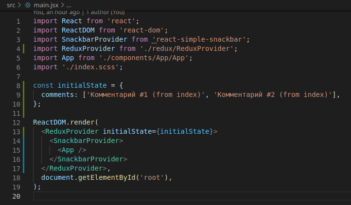
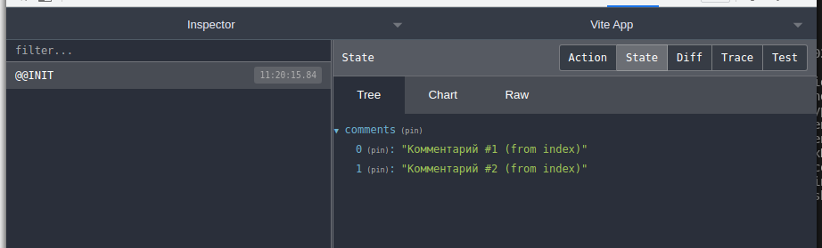

# Как быстро добавить Ридакс в Реакт проект (+ DevTools)
Задача добавить Ридакс в проект на Реакте возникает регулярно. Через какое-то время я решил подготовить "набор команд" и "стартовые файлы" в одном месте. Итак, для подключения:

## 1 Устанавливаем нужные нам пакеты
```
npm i react-redux redux redux-promise
```
последний - опционально - он позволяет удобнее работать с асинхронными запросами в Ридакс, но не нужен, если вы используете Саги или другой подход.

и пакет девтулсов:
```
npm i redux-devtools-extension --save-dev
```

## 2 Копируем файлы стартера
Сейчас в корне репозитория есть папка redux-starter. Я копирую её в src своего проекта и переименовываю в redux. Это вариант, в котором редюсеры, экшены и провайдер собраны в одной папке. Ещё и демо тут. Конечно, если проект большой, модульная структура, экшены и редюсеры будут в папках модулей... Но тогда и этот стартер вряд ли пригодится.)

## 3 Подключаем провайдер в главном файле проекта
Как-то так:
```javascript
import ReduxProvider from './redux/ReduxProvider';
import App from './components/App/App';
import './index.scss';

const initialState = {
  comments: ['Комментарий #1 (from index)', 'Комментарий #2 (from index)'],
};

ReactDOM.render(
  <ReduxProvider initialState={initialState}>
    <SnackbarProvider>
      <App />
    </SnackbarProvider>
  </ReduxProvider>,
  document.getElementById('root'),
);
```

привёл часть кода файла main.js (сборка на Vite), также это может быть index.js (CRA, например).
Если коротко, то мы:
- импортируем провайдер из стартового пакета,
- создаём небольшой "демо-стейт",
- оборачиваем наше приложение в провайдер.

А вот тут на скриншоте видно, в каких строках изменения:


## 4 (если до этого ни разу) Устанавливаем расширение Chrome
[отсюда](https://chrome.google.com/webstore/detail/redux-devtools/lmhkpmbekcpmknklioeibfkpmmfibljd)

Уже после этого мы после старта видим, что redux в проекте работает - initialState, который мы прописали, можно увидеть в DevTools (для просмотра всего стейта не забываем переключиться на вкладку State):


## 5 (быстрый тест)
(в разработке)
