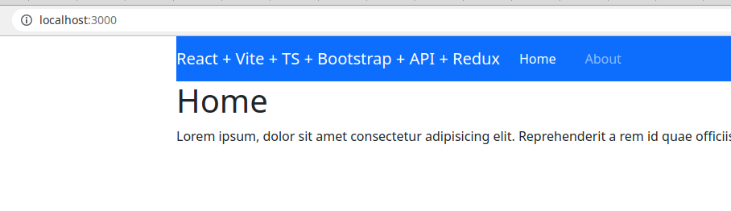
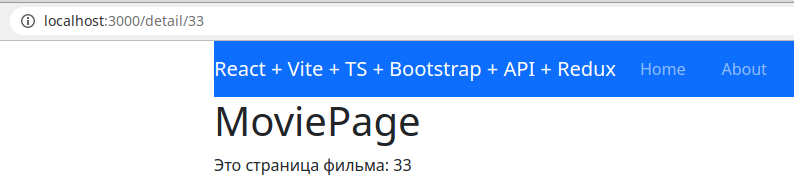

# React - добавляем роутинг - React Router
Я немного прыгаю с темы на тему в своих описаниях, потому что сам не всё успеваю. Кажется, пришло время написать про React Router. Итак, задача простая: у нас есть приложение на Реакте, пока что оно - практически стартер Vite с прикрученными пакетами для тестов. Вчера я прикрутил к нему Ридакс (по шпаргалке, которая ниже) и Саги (перенёс из сторого проекта, вроде работают). Пришло время сделать страницы и навигацию. Стартер был в TypeScript версии, но для роутера уж это не принципиально.

## Установка пакета
Я за то, чтобы читать документацию. В ней уже есть ответы на много вопросов, которые идут гуглить. [React Router Quick Start](https://reactrouter.com/web/guides/quick-start).
Но дальше обойдемся и без документации (пока). Установка:
```
npm i react-router-dom
```

Т.к. у нас TS, поставим ещё типы:
```
npm i --save-dev @types/react-router-dom
```

## Установка SASS (опционально)
Это не обязательный шаг. А может у вас он уже есть. Дальше я буду импортировать стили Бутстрапа, да и вообще с SASS удобнее, поэтому ставим пакет:
```
npm i sass --save-dev
```

После это App.css переименуем в App.scss и изменим импорт в App.tsx. Я пока просто всё удалю из этого файла.

## Подключение бутстрап (опционально)
Я когда-то верстал с бутстрапом, и сейчас довольно часто подключаю его, когда нужно получить какой-то визуал быстро. Для этого необходимо.
1) установить пакеты:
```
npm i react-bootstrap bootstrap
```

2) импортировать css в App.scss
```
@import "bootstrap/scss/bootstrap";
```

## Создание страниц
Чтобы было, между чем переключаться, создадим папку pages и в ней заготовки нескольких страниц. У меня под рукой есть вот такая:

```javascript
import React from 'react';

const Home = () => (
  <div className="container">
    <h1>Home</h1>
    <p>
      Lorem ipsum, dolor sit amet consectetur adipisicing elit.
      Reprehenderit a rem id quae officiis distinctio ipsa, quidem nisi amet eos?
    </p>
  </div>
);

export default Home;
```

Таким же образом сделаю About и Error404, где сразу напишу: страница не найдена.
Страниц может быть много, импортировать каждую из отдельного файла в App - много строчек писать, поэтому в папке pages создам сразу index.ts:
```javascript
import About from './About';
import Home from './Home';
import Error404 from './Error404';

export {
  About, Home, Error404,
};
```
Здесь просто импортируем отдельные страницы и экспортируем одним объектом. Это не обязательно, но так удобнее.)

## Создание верхнего меню
Здесь я использую "заготовку" - скопирую код, который уже использовал. Создадим компонент Nav (в папке components).
Nav.tsx:
```javascript
import React from 'react';
import { NavLink } from 'react-router-dom';
import './Nav.scss';

const Nav = () => {
  const title = 'React + Vite + TS + Bootstrap + API + Redux';
  const links = [
    { name: 'Home', link: '/', exact: true },
    { name: 'About', link: '/about', exact: false },
  ];

  let htmlLinks: any = [];
  if (Array.isArray(links) && links.length) {
    htmlLinks = links.map((item) => (
      <li className="nav-item" key={`key_${item.link}`}>
        <NavLink exact={item.exact} to={item.link} className="nav-link">{item.name}</NavLink>
      </li>
    ));
  }

  return (
    <nav className="navbar navbar-dark bg-primary navbar-expand-lg">
      <div className="navbar-brand">{title}</div>
      <ul className="navbar-nav">{htmlLinks}</ul>
    </nav>
  );
};

export default Nav;
```

Чтобы не отвлекаться на TS, htmlLinks пока зададим тип any. Но это плохая практика!
Компонент может показаться громоздким. Но в нём весь "контент" вынесен в переменные - их легко редактировать, можно также получать по апи или вынести в пропсы.

Чуть-чуть стилей в Nav.scss:
```css
.navbar-nav {
  flex-direction: row;
}

.navbar-nav li {
  margin-right: 20px;
}

.navbar-nav li:last-child {
  margin-right: 0;
}
```

## Подключение
Подключать будем в файле App.
Импортируем функции роутера и страницы:
```javascript
import {
  BrowserRouter, Switch, Route, Redirect,
} from 'react-router-dom';
import {
  About, Home, Error404, MoviePage,
} from './pages';
import Nav from './components/Nav/Nav';
```

Дальше пример самого простого App, в котором на всех страницах выводится навигационная панель, которую мы создали выше, и настроено переключение между страницами:
```javascript
const App = () => (
  <BrowserRouter basename="/">
    <div className="container">
      <Nav />
    </div>
    <Switch>
      <Route path="/" exact component={Home} />
      <Route path="/about" component={About} />
      <Route path="/detail/:id" component={MoviePage} />
      <Route path="/404" component={Error404} />
      <Redirect to="/404" />
    </Switch>
  </BrowserRouter>
);
```

У меня сейчас уже есть эксперименты с Ридакс в Апп, поэтому он будет чуть сложнее - не стрелкой. Но сути это не меняет.

Да, нам же понадобится детальная страница! Создадим сразу компонент MoviePage для неё - можно скопировать существующую, и добавим во всем импорты-экспорты.

После сохранения Vite обновляет наше приложение в браузере и мы видим что-то подобное:



Ссылки Home и About в меню должны работать.)

## Детальная страница
Страница, при переходе на которую мы будем использовать какой-то параметр - id фильма, например, который нам надо будет показать в адресной строке и который надо будет получить на странице и использовать (для запроса к апи или для выборки данных из Ридакс, например).

В App мы уже сделали для этого заготовку, вот здесь:
```javascript
      <Route path="/detail/:id" component={MoviePage} />
```

:id - тот самый параметр.

Теперь нам надо использовать его на странице. Для этого импортируем useParams из Роутера:
```javascript
import { useParams } from 'react-router-dom';
```

в самом начале компонента страницы получим id:
```javascript
  const { id } = useParams();
```

И используем его в коде, например:
```javascript
      <h1>MoviePage</h1>
      <p>{`Это страница фильма: ${id}`}</p>
```

В браузере откроем адрес http://localhost:3000/detail/33 . Мы должны увидеть что-то подобное:


Нам ещё надо будет перейти на эту страницу из списка фильмов или других карточек. Но это на этапе создания одельных карточек будем делать.